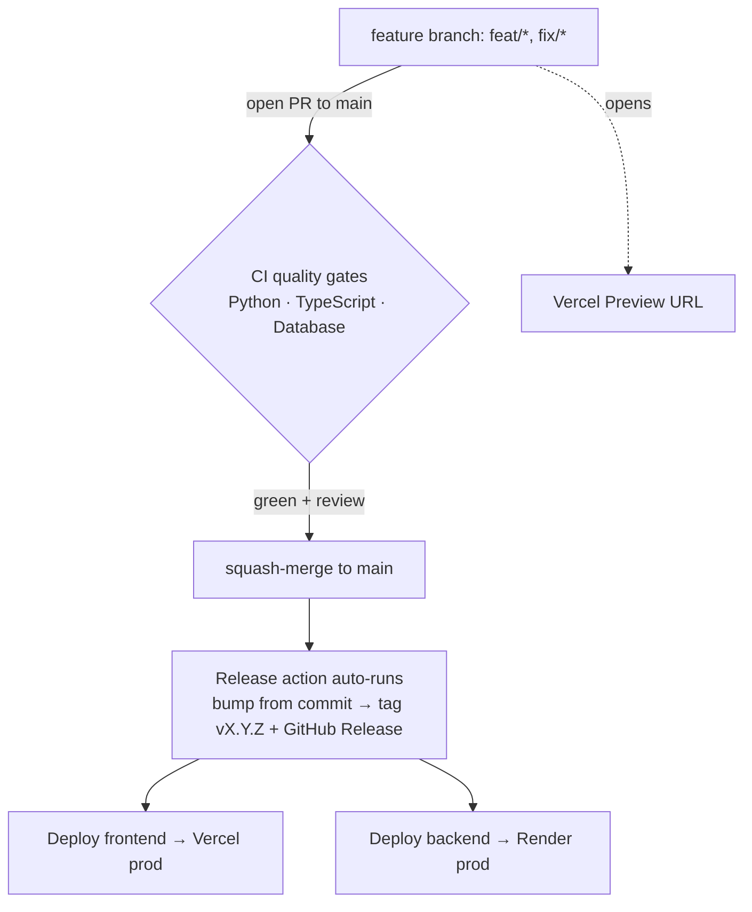

# Release & Deployment

Trunk-based development with **automatic releases on merge to `main`**. One `main`
branch; feature branches off it; when a PR merges, the **Release** action cuts a
unified `vX.Y.Z` tag (bump derived from the merge commit) and deploys the frontend
to **Vercel** and the backend to **Render**.

## Flow

- **Open a PR to `main`** → the CI quality gates run immediately, plus an automatic
  **Vercel Preview** URL (frontend). Not production.
- **Merge to `main`** → the Release action fires: it tags `vX.Y.Z` and deploys to
  production. This is continuous deployment — **every merge ships**.
- Skip a release for a given merge by putting `[skip release]` in the commit message.

## Branching

- `main` — single trunk, branch-protected (require the CI gates + 1 review).
- Feature branches off `main`: `feat/<slug>`, `fix/<slug>` → PR → CI → squash-merge → delete.
- No long-lived `develop`/`release` branches.

## Cutting a release

**Normally you don't** — it's automatic. When a PR squash-merges to `main`, the
Release action:

- reads the merge commit's Conventional Commit type and picks the bump:
  `feat:` → **minor**, `fix:` / `chore:` / `docs:` / etc. → **patch**,
  `feat!:` or `BREAKING CHANGE` → **major**,
- computes the next `vX.Y.Z` from the latest tag,
- creates an annotated tag + a GitHub Release with auto-generated notes,
- deploys that exact tag: **frontend → Vercel**, **backend → Render** (parallel).

> Bump detection assumes **squash-merge** (so `main`'s commit subject is the PR's
> Conventional Commit title). Keep squash-merge on for `main`.

**Manual override:** GitHub → **Actions** → **Release** → **Run workflow** (from
`main`) → pick an explicit `patch` / `minor` / `major`. Use this to force a version
regardless of the last commit.

**Skip a release:** include `[skip release]` in the merge commit message (e.g. for a
docs- or CI-only change you don't want to ship).

Rollback = run the platform's "redeploy previous" (Vercel: promote an earlier
deployment; Render: redeploy a prior deploy), or cut a new tag from a fixed commit.

## How production requests are wired

The frontend calls **relative** `/api/...` paths (no hard-coded backend origin).
In production, [`frontend/vercel.json`](../frontend/vercel.json) **rewrites**
`/api/*` to the Render backend, so the browser stays same-origin with Vercel and
**no CORS is involved**.

> Update the rewrite `destination` in `frontend/vercel.json` to your real Render
> URL (e.g. `https://denthub-backend.onrender.com`) once the service exists.

---

## One-time setup

The workflow is safe to commit before this is done — the deploy jobs **skip with a
warning** until their secrets exist (the tag + Release are still created).

### 1. Render (backend)

1. New → **Blueprint**, point it at this repo — it reads [`render.yaml`](../render.yaml)
   and creates the `denthub-backend` web service (`autoDeploy: false`).
2. Service → **Settings → Deploy Hook** → copy the URL.
3. Confirm the health check is `/api/v1/health`.

### 2. Vercel (frontend)

1. **New Project** → import this repo.
2. Set **Root Directory** = `frontend` (Framework auto-detects as Vite).
3. Turn **off** auto production deploys so tags are the only prod trigger — set the
   **Production Branch** to an unused branch (e.g. `_none`), or add an
   *Ignored Build Step* that skips production. Leave **Preview** deploys on (that's
   what gives PRs their preview URLs).
4. Grab the project's IDs: run `vercel link` locally, then read `.vercel/project.json`
   (`orgId`, `projectId`), and create a token at **Account → Settings → Tokens**.

### 3. GitHub secrets

Repo → **Settings → Secrets and variables → Actions** → add:

| Secret | From |
|---|---|
| `VERCEL_TOKEN` | Vercel account token |
| `VERCEL_ORG_ID` | `.vercel/project.json` → `orgId` |
| `VERCEL_PROJECT_ID` | `.vercel/project.json` → `projectId` |
| `RENDER_DEPLOY_HOOK_URL` | Render service → Deploy Hook URL |

### 4. Branch protection (`main`)

Repo → **Settings → Branches** → protect `main`:
- Require a PR before merging (≥ 1 approval).
- Require status checks: **Python Quality**, **TypeScript Quality**, **Database Quality**.
- Require branches up to date before merging.

---

## Why tags drive deploys (the gotcha)

Neither Vercel nor Render deploys on git **tags** in their native Git integration —
both are **branch**-based. So the **GitHub Action is the deployer**: it builds/deploys
the tagged commit via the Vercel CLI and a Render deploy hook, and each platform's own
production auto-deploy is turned **off**. That's what makes "tag = production release"
work with these two providers.
