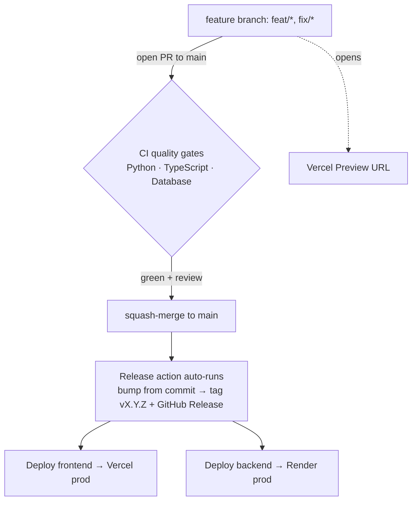

# Release & Deployment

Trunk-based development with **automatic releases on merge to `main`**. One `main`
branch; feature branches off it; when a PR merges, the **Release** action cuts a
unified `vX.Y.Z` tag (bump derived from the merge commit) and deploys the frontend
to **Vercel** and the backend to **Render**.

## Flow


```mermaid
flowchart TD
    A[feature branch: feat/*, fix/*] -->|open PR to main| B{CI quality gates<br/>Python · TypeScript · Database}
    A -.->|opens| P[Vercel Preview URL]
    B -->|green + review| C[squash-merge to main]
    C --> R[Release action auto-runs<br/>bump from commit → tag vX.Y.Z + GitHub Release]
    R --> V[Deploy frontend → Vercel prod]
    R --> D[Deploy backend → Render prod]
```

- **Open a PR to `main`** → the CI quality gates run immediately, plus an automatic
  **Vercel Preview** URL (frontend). Not production.
- **Merge to `main`** → the Release action fires: it tags `vX.Y.Z` and deploys to
  production. This is continuous deployment — **every merge ships**.
- Skip a release for a given merge by putting `[skip release]` in the commit message.

## Branching

- `main` — single trunk, branch-protected (require the CI gates + 1 review).
- Feature branches off `main`: `feat/<slug>`, `fix/<slug>` → PR → CI → squash-merge → delete.
- No long-lived `develop`/`release` branches.

## Cutting a release

**Normally you don't** — it's automatic. When a PR squash-merges to `main`, the
Release action:

- reads the merge commit's Conventional Commit type and picks the bump:
  `feat:` → **minor**, `fix:` / `chore:` / `docs:` / etc. → **patch**,
  `feat!:` or `BREAKING CHANGE` → **major**,
- computes the next `vX.Y.Z` from the latest tag,
- creates an annotated tag + a GitHub Release with auto-generated notes,
- deploys that exact tag: **frontend → Vercel**, **backend → Render** (parallel).

> Bump detection assumes **squash-merge** (so `main`'s commit subject is the PR's
> Conventional Commit title). Keep squash-merge on for `main`.

**Manual override:** GitHub → **Actions** → **Release** → **Run workflow** (from
`main`) → pick an explicit `patch` / `minor` / `major`. Use this to force a version
regardless of the last commit.

**Skip a release:** include `[skip release]` in the merge commit message (e.g. for a
docs- or CI-only change you don't want to ship).

Rollback = run the platform's "redeploy previous" (Vercel: promote an earlier
deployment; Render: redeploy a prior deploy), or cut a new tag from a fixed commit.

## How production requests are wired

The frontend calls **relative** `/api/...` paths (no hard-coded backend origin).
In production, [`frontend/vercel.json`](../frontend/vercel.json) **rewrites**
`/api/*` to the Render backend, so the browser stays same-origin with Vercel and
**no CORS is involved**.

> Update the rewrite `destination` in `frontend/vercel.json` to your real Render
> URL (e.g. `https://denthub-backend.onrender.com`) once the service exists.

---

## One-time setup

> **The deploy jobs fail the workflow when their secrets are missing.** They used to
> skip with a warning, which meant every release went green while deploying nothing
> — so a merged PR looked like it was live when it wasn't. Now a missing secret is a
> red `::error::` and a non-zero exit. If Release goes red on a deploy job, the tag
> exists but **production is behind `main`** — fix the secret and re-run the workflow
> (`workflow_dispatch`) to deploy the same version.

The tag + GitHub Release are still created even when a deploy fails, so version
history stays intact. Re-running with `bump: patch` would cut a *new* tag, so prefer
re-running the failed run from the Actions UI.

### 1. Render (backend)

1. Provision a **Postgres** database first (Render → *New → Postgres*). The free web
   plan's filesystem is **ephemeral**: a SQLite file on it is wiped on every deploy.
   Production must use a real Postgres URL.
2. New → **Blueprint**, point it at this repo — it reads [`render.yaml`](../render.yaml)
   and creates the `denthub-backend` web service (`autoDeploy: false`).
3. Service → **Environment** → add `DATABASE_URL` = the Postgres connection string
   (use the *internal* URL, e.g. `postgresql+asyncpg://…`, so traffic stays on
   Render's private network). It is declared `sync: false` in `render.yaml` and must
   never be committed.
4. Service → **Settings → Deploy Hook** → copy the URL.
5. Confirm the health check is `/api/v1/health`.

> The blueprint sets `preDeployCommand: uv run alembic upgrade head`, so migrations
> apply before the new build goes live. If you change the database URL after the first
> deploy, run `alembic upgrade head` against it once by hand.

### 2. Vercel (frontend)

1. **New Project** → import this repo.
2. Set **Root Directory** = `frontend` (Framework auto-detects as Vite).
3. Turn **off** auto production deploys so tags are the only prod trigger — set the
   **Production Branch** to an unused branch (e.g. `_none`), or add an
   *Ignored Build Step* that skips production. Leave **Preview** deploys on (that's
   what gives PRs their preview URLs).
4. Grab the project's IDs: run `vercel link` locally, then read `.vercel/project.json`
   (`orgId`, `projectId`), and create a token at **Account → Settings → Tokens**.

### 3. GitHub secrets

Repo → **Settings → Secrets and variables → Actions** → add:

| Secret | From |
|---|---|
| `VERCEL_TOKEN` | Vercel account token |
| `VERCEL_ORG_ID` | `.vercel/project.json` → `orgId` |
| `VERCEL_PROJECT_ID` | `.vercel/project.json` → `projectId` |
| `RENDER_DEPLOY_HOOK_URL` | Render service → Deploy Hook URL |

### 4. Branch protection (`main`)

Repo → **Settings → Branches** → protect `main`:
- Require a PR before merging (≥ 1 approval).
- Require status checks: **Python Quality**, **TypeScript Quality**, **Database Quality**.
- Require branches up to date before merging.

---

## Verifying a release actually shipped

A green Release run no longer proves production is serving. After the one-time setup,
spot-check the deployed app:

```bash
curl -fsS https://denthub-backend.onrender.com/api/v1/health   # expect {"status":"ok",…}
curl -fsS https://<your-vercel-domain>/api/v1/health          # same, via the rewrite
```

A **404** from the Render URL means the service was never created or the name in
`frontend/vercel.json` doesn't match it. A **health 200 but `/api/v1/products` 500**
means migrations didn't run — check the deploy log for the `preDeployCommand` step.


---

## Why tags drive deploys (the gotcha)

Neither Vercel nor Render deploys on git **tags** in their native Git integration —
both are **branch**-based. So the **GitHub Action is the deployer**: it builds/deploys
the tagged commit via the Vercel CLI and a Render deploy hook, and each platform's own
production auto-deploy is turned **off**. That's what makes "tag = production release"
work with these two providers.
